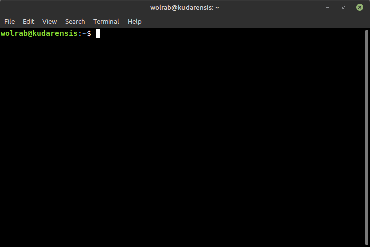

```{r setup, include = FALSE}

library(ggplot2)
library(RColorBrewer)
library(knitr)
library(ape)

knitr::opts_chunk$set(echo = FALSE)
```


## Schedule


| Date | Time | Activity |
|------|------|----------|
| Mon 03/11/2024 | 10:00 to 16:00 | Unix-like systems, bash, connecting to SCWales |
| Tue 04/11/2024 | 10:00 to 16:00 | More bash, SCWales, using SCWales and slurm |
| Wed 05/11/2024 | 10:00 to 16:00 | Illumina data, BEARCAVE, data processing |
| Thu 06/11/2024 | 10:00 to 16:00 | ANGSD, covariance and distance matrices, heterozygosity, intro to R |
| Fri 07/11/2024 | 10:00 to 16:00 | Maps, PCA's, NJ trees, Manhattan plots and Rmarkdown |

## Prequisites

- a computer with internet connection
- an account on super-computing Wales
- basic knowledge of DNA and genome structure

## Resources

### Lecture slides

<https://drabarlow.github.io/bioinformatics_bootcamp/>

### Bootcamp worksheet

<https://drabarlow.github.io/bioinformatics_bootcamp/bootcamp_worksheet.html>

### Github repo

<https://github.com/drabarlow/bioinformatics_bootcamp>

### Supercomputing Wales shared project

- please request access to: **scw2141 Bioinformatics training**


## Introductions

### Axel Barlow, Lecturer in Zoology at Bangor University

**Interests**
- Population and evolutionary genomics of animals. Palaeogenomics of extinct animals. Conservation genomics of native species

**Bioinformatics experience**

- Self taught post-PhD
- No proper bioinformatics/computer science background
- Knowledge of `bash` and `R`.

### Johanna Paijmans, Lecturer in Zoology at Bangor University

**Interests**
- Population and evolutionary genomics of animals. Palaeogenomics of extinct animals. Drivers of population dynamics through time

**Bioinformatics experience**

- Self taught (by rebelling against a Linux-expert father)
- No proper bioinformatics/computer science background
- Knowledge of `bash` and `R`.


# Unix-like systems and bash


## Unix {.columns-2}


- Operating system developed in 1969 by Bell Labs
- Unix philosophy: *operating system should provide a set of simple tools, each of which performs a limited, well-defined function.*
- Modular (small programs strung together)
- Inter-process communication: "pipes"
- Separate normal and "super" users (`sudo`)
- Hierarchical filesystem
- A shell for executing and combining tools
- The basis of many subsequent OS

<br> 

```{r, out.width = "40%"}
include_graphics("./assets/img/Operating_system_placement.svg.png")
```

```{r, out.width = "70%"}
include_graphics("./assets/img/unix-an-open-group-standard.png")
```


## Unix

<iframe src = 'https://en.wikipedia.org/wiki/Unix' height='600px'></iframe>


## Unix-like systems {.columns-2}


**Mac OS**

- Released 1984
- Developed from NeXTSTEP, which is developed from Unix
- Proprietary, only available with Apple hardware

**Linux**

- 21 year old Linus Torvalds coded a Unix inspired OS in 1991
- Free and open source
- The core linux kernal available under many distributions: Ubuntu, Mint, Arch, RedHat, Android, Tesla, etc.


```{r, out.width = "90%"}
include_graphics("./assets/img/main-qimg-592cd3e8f514ec3fd00dd6490d889926-lq.jpeg")
```


## MS-DOS (Windows) {.columns-2}


- Developed by Microsoft, released 1981
- Main OS for IBM PCs in 1980s
- GUI introduced with Windows, released 1985
- Largest market share (70% of PCs)
- Some bioinformatics possible (e.g. `R` typically via `Rstudio`)
- No `bash`
- Encoding of text files is different
- Majority of bioinfomatics software unsupported
- Windows subsystem for linux <https://learn.microsoft.com/en-us/windows/wsl/install>
- Seamless transfer between `DOS` and `Unix` not yet possible


```{r, out.width = "80%"}
include_graphics("./assets/img/Msdos-icon.svg.png")
```

```{r, out.width = "80%"}
include_graphics("./assets/img/StartingMsdos.png")
```


## OS comparison

||Windows|Mac|Linux|
|-------|---|-----|
|standard PC functions|yes|yes|yes|
|cost|yes|yes|free|
|hardware choice|yes|no|yes|
|bioinformatics|no|yes|yes|
|HPC|no|no|yes|
|open source|no|no|yes|
|active community|no|no|yes|
|games|yes|some|some|


## Terminal emulators and Bash {.columns-2}


- a shell allows users to execute OS tools
- Accessed using a terminal
- Unix terminal came with the Bourne shell (`sh`), developed by Steven Bourne in 1979
- In 1979 Brian Fox in improved version: the Bourne again shell (`bash`)
- Most Unix-like OS use `bash` or something like it
  - execute standard OS functions and installed programs
  - access filesystem
  - supports bash scripts
  - pipes, auto-completion, loops, wildcards, etc.
  

```{r, out.width = "90%"}
include_graphics("./assets/img/Gnu-bash-logo.svg.png")
```

```{r, out.width = "90%"}

```


# AI

## A note on AI in Bioinformatics

- AI tools are becoming increasingly common in bioinformatics
- It's incredible powerful, but keep various considerations in mind (ethics, reproducibility, accuracy)
- Different models are better or worse for different tasks (ChatGPT is not great at programming, Claude is better ime)

# Supercomputing Wales and slurm


## Supercomputing Wales

- £16m investment, part-funded by the European Regional Development Fund (ERDF) through Welsh Government
- Provide university research teams access to HPC (High Performance Computing)
- Consortium of Cardiff, Swansea, Bangor and Aberystwyth
- 2 Supercomputers:
  - Cardiff HPC System - Hawk
  - Swansea HPC System - Sunbird
- Hawk: 280 nodes, 12,736 cores, 68.224 TB memory
- (yours: 1 node, 4-16 cores, 16-96 Gb memory)

```{r, out.width = "80%"}
include_graphics("./assets/img/lgo_supercomputingWales-1.png")
```


## Hawk (soon to be retired! Followed by Falcon)

- Scientific linux OS
- **compute nodes**
  - 134x Intel nodes with 20 cpus + 192 Gb RAM each
  - 64x AMD nodes with 32 cpus + 256 Gb RAM each
- **high memory nodes**
  - 26 nodes with 384 Gb RAM each
- **GPU nodes**
  - 26 Nvidia P100 GPUs on 13 nodes
  - 30 Nvidia V100 GPUs on 15 nodes
- **Storage**
  - 1192TB (usable) scratch space
  - 420TB of home directory space


## Hawk users

- Anyone in consortium Universities
- Guests possible, with some restrictions
- Ability to set up shared projects
- Generally max 10 running jobs (ways around it)
- Three day max runtime (ways around it)
- Generally ~50 Gb home dir
- Generally 3 Tb scratch space (currently an issue)
- Uses `Slurm` job scheduler
- Many programs installed as `modules`
- No super user access
- Can seek help from eResearch manager Ade Fewings (a.fewings@bangor.ac.uk)


```{r, out.width = "70%"}
include_graphics("./assets/img/Untitled.jpeg")
```


## Filesystem

- `/` [root] is uppermost level of filesystem
- Everything is contained in `/`
- Directories exist within the filesystem, they can contain files and other directories
- We specify a path through this hierarchy using forward-slashes (note back-slashes on `DOS`)
- Our current directory is called the `working directory`

```bash
/home/b.xlb21brx/
/scratch/b.xlb21brx/
```
- We can navigate through the filesystem (change working directory)
- Or we can specify the patch to directories or files remotely


## Slurm


- Simple Linux Utility for Resource Management: `Slurm`
- Free open source job scheduler for linux systems
- Used on 60% of World's top 500 computers
- Assigns user jobs to computer resources 
- Submit to queue
- Short, low-resource jobs move faster through the queue
- Other tools for scheduling, reporting, etc


```{r, out.width = "70%"}
include_graphics("./assets/img/1024px-Slurm_logo.svg.png")
```


# Illumina data


## Illumina sequencing platforms

```{r, out.width = "100%"}
  include_graphics("./assets/img/illumina.svg")
```


## Data output

|Platform | Million reads | Read length | Gb data | Genome coverage
||||
MiniSeq|25|2 x 150 bp|7.5|2
MiSeq|25|2 x 300 bp|15|4
NextSeq|400|2 x 150 bp|120|33
HiSeq X|6000|2 x 150 bp|1800|500
NovaSeq|20000|2 x 150 bp|6000|1667


## Sequencing by synthesis

1. Sample preparation
2. Bind DNA to flowcell, generate clusters
3. Sequencing by synthesis
4. Data analysis (in the machine)

<https://www.youtube.com/watch?v=fCd6B5HRaZ8>


## Sample preparation

```{r, out.width = "100%"}
  include_graphics("./assets/img/library_molecule.svg")
```

*Indexes allow multiple samples to be sequenced at the same time


## Flow cell

```{r, out.width = "80%"}
  include_graphics("./assets/img/flowcell.svg")
```

 bg:white

## Cluster generation

```{r, out.width = "70%"}
  include_graphics("./assets/img/cluster.svg")
```


## Sequencing by synthesis

```{r, out.width = "100%"}
  include_graphics("./assets/img/sbs.svg")
```


## Data analysis (in the machine)

```{r, out.width = "85%"}
  include_graphics("./assets/img/dataanalysis.svg")
```


## What do we sequence?

[Not an exhaustive list]

- **Whole genome sequencing (pure DNA sample from a single individual)**
- Reduced representation genome data (RADseq, targeted SNPs, single individual)
- Poolseq (multiple individuals)
- Transcriptome (RNA sample from single tissue/individual)
- Metabarcoding (PCR amplicon, multiple individuals/species)
- Metagenomics (whole genomes, multiple individuals/species)


## Whole genome sequencing

Short reads from a single individual can be mapped to a reference genome assembly

```{r, out.width = "95%"}
  include_graphics("./assets/img/pseudohap.svg")
```


## Whole genome sequencing

```{r, out.width = "100%", .fig.align = "left", fig.cap=""}
  include_graphics("./assets/img/Screenshot from 2022-09-08 13-58-44.png")
```


## Illumina summary

- The current market leader
- Massive output
- Many applications (genome resequencing, RADseq, transcriptomes, metabarcoding)
- Cheap (£10 per Gb)
- Major limitation is the read length


# BEARCAVE


## BEARCAVE

- Nikolas Basler, Achim Klittich, Axel Barlow
- An environment for organising, processing, and archiving Illumina data
- BEARCAVE philosophy
  - All users can access all data
  - Avoid data redundancy
  - All samples processed using identical software programs and parameters
  - Incorporates sample metadata
  - Documents results of data processing
  - Easy to use wrapper scripts for programs
  - Publicly available
  - Safeguards in place to ensure consistency
- Consequently BEARCAVE is not for everyone, and has idiosyncrasies in use


## Our project: adder population genomics


- Adders (*Vipera berus berus*) widespread across northern Eurasia
- Threatened or near-threatened in UK
- Illumina PE data from 27 individuals
- Plus one outgroup (*Vipera berus bosniensis*)
- 7 locations
- **Our tasks**
  - Data format
  - Adapter trimming and read merging
  - Map to reference genome: chr7

*** =right

```{r, out.width = "90%"}
include_graphics("./assets/img/male.jpg")
```

```{r, out.width = "90%"}
include_graphics("./assets/img/female.jpg")
```


## Adder locations

sample|locality
|
adder01-04|Dublin
adder05-08|Belfast
adder09-12|Cork
adder13-16|Limerick
adder17-20|Galway
adder21-24|Dundalk
adder25-27|Bray
adder28|outgroup


# Illumina data processing


## .fastq file format

- fastq is the standard output format for data from Illumina (and other) platforms

```bash
@A00551:758:HKTVJDSX7:4:1101:3595:6872 1:N:0:CCTGAGATGT+GGTCTAGTTG
CTGAATATGGATTTTAATTGAATCCTAAGATATTATAGCATCTTTCACTCCCTGTCCTGTGCATGTCAGA
+
FFFFFFFFFFFFFFFFFFFFFFFFFFFFFFFFFFFFFFFFFFFFFFFFFFFFFFFFFFFFFFFFFFFFFF
```

- **Line 1**: info on sequencer, flowcell, cluster position, indexes (sometimes)
- **Line 2**: called bases
- **Line 3**: a +
- **Line 4**: quality scores on Phred scale
- 10 = 90% accuracy; 20 = 99% accuracy; 30 = 99.9% accuracy
- Recoded as single character: F = 37; ? = 30; 5 = 20; + = 10


# Adapter trimming and read merging


## DNA fragment length distribution

- DNA can be fragmented
- The fragment lengths have a **distribution**


```{r, out.width = "100%", out.height = "100%", fig.width = 8, fig.height = 7, dpi = 600}
# function for calculating mode
getmode <- function(v) {
   uniqv <- unique(v)
   uniqv[which.max(tabulate(match(v, uniqv)))]
}

adna <- read.table("./assets/data/HV74-Dab-SS_S12_dataset1_rld.txt", header=TRUE)

plot <- ggplot(adna) +
  geom_histogram(aes(x=bp), fill="lightgrey", colour="black", show.legend=TRUE, bins = 30) +
  theme_bw(base_size = 25)+
  labs(x="DNA fragment length (bp)", y="count")

plot
```

```{r, out.width = "100%"}
include_graphics("./assets/img/kudarensis.png")
```

45 ka cave bear (*Ursus kudarensis*)

 

## Effect of insert size

```{r, out.width = "100%"}
include_graphics("./assets/img/trim1.svg")
```

 

## Effect of insert size

```{r, out.width = "100%"}
include_graphics("./assets/img/trim2.svg")
```

 

## Effect of insert size

```{r, out.width = "100%"}
include_graphics("./assets/img/trim3.svg")
```

 

## Effect of insert size

```{r, out.width = "100%"}
include_graphics("./assets/img/trim4.svg")
```

 

## Effect of insert size

```{r, out.width = "100%"}
include_graphics("./assets/img/trim5.svg")
```

 

## Effect of insert size

```{r, out.width = "100%"}
include_graphics("./assets/img/trim6.svg")
```

 

## Adapter trimming

```{r, out.width = "100%"}
include_graphics("./assets/img/trim9.svg")
```

 

## Overlapping reads are merged

```{r, out.width = "100%"}
include_graphics("./assets/img/trim10.svg")
```


## BEARCAVE script

- decompress fastqs
- trim adapter seqs using `Cutadapt`
  - 30 bp min length
  - min overlap 1 bp
- merge overlapping read pair using `FLASH`
- recompress files and clean up 
- save appropriate log files

**Expected output in** `/BEARCAVE2/trimdata/*processing/`

- merged reads `*_mappable.fastq.gz` [big file]
- unmerged R1 `*_mappable_R1.fastq.gz` [big file]
- unmerged R2 `*_mappable_R2.fastq.gz` [big file]
- trim report `*_trim_report.log` and merge report `*_merge_report.log`


## Cutadapt

```{r, out.width = "100%", out.height=500, .fig.cap=""}
include_graphics("./assets/img/2011-Cutadapt_removes_adapter_sequences_from_high-throughput_sequencing_reads.pdf")
```

 

## FLASH

```{r, out.width = "100%", out.height=500, .fig.cap=""}
include_graphics("./assets/img/2011-FLASH_fast_length_adjustment_of_short_reads_to_improve_genome_assemblies..pdf")
```


# Mapping


## BEARCAVE mapping script

- decompress fastqs
- merged (SE) and PE data processed separately
  - mapping using `bwa` mem algorithm
  - PCR duplicates identified and removed using `samtools`
  - Reads with poor mapping quality (Q30) removed using `samtools`
- SE and PE data merged
- mapping log file generated
- file cleanup and renaming

**Expected output in** `/BEARCAVE2/mapped*/*processing/`

- mapped filtered data `*.bam` [big file]
- bam index `*.bam.bai`
- mapping log `*_mapping.log`


## bwa

```{r, out.width = "100%", out.height=500, .fig.cap=""}
include_graphics("./assets/img/2009-Fast_and_accurate_short_read_alignment_with_Burrows-Wheeler_transform..pdf")
```

 

## samtools (48,024 citations)

```{r, out.width = "100%", out.height=500, .fig.cap=""}
include_graphics("./assets/img/2009-The_Sequence_AlignmentMap_format_and_SAMtools.pdf")
```

 .segue .dark 

## Population genomics using `angsd`


## angsd

- Widely used program
- MANY population genetics analyses possible
- Tends to work directly from bam files (unlike `plink`, `admixtools`, etc)
- MANY filters available
- Genotype likelihood approach is a particular speciality

Allele1|Allele2|prob11|prob12|prob22
||||
A|T|0.05|0.9|0.05

- Several spin off programs that use GLs
  - `NGSadmix`
  - `PCangsd`
  - `NGSrelate`
  - `realSFS`


## angsd website

<iframe src = 'http://www.popgen.dk/angsd/index.php/ANGSD' height='600px'></iframe>


## angsd paper

```{r, out.width = "100%", out.height=500, .fig.cap=""}
include_graphics("./assets/img/2014-Open_Access_ANGSD__Analysis_of_Next_Generation_Sequencing_Data.pdf")
```


## Covariance matrix, distance matrix, heterozygosity

**Covariance matrix**

- All indviduals
- Allele frequency covariance matrix
- Used for PCA

**Distance matrix**

- All individuals
- absolute genetic distance between populations
- used as input for NJ algorithm

**Heterozygosity**

- Your single adder
- Calculate GLs, ML estimation of SFS along a sliding window using `realSFS`

# Intro to R

## What is `R` {.columns-2}

- Statistical analysis 
- Data visualisation
- Free and open source
- Linux, Mac, Windows
- Many additional packages
- Several GUIs e.g. `Rstudio`
- Graphics (even interactive), text documents, websites
- This presentation!


```{r, out.width = "100%"}
include_graphics("./assets/img/R_logo.svg.png")
```


## How `R` works

```{r, out.width = "100%"}
include_graphics("./assets/img/R_works.png")
```


## Why is bash faster than `R`?

Suppose you're a survey company. To carry out your survey you need all the people seated in a classroom, which you have to build. You're not sure how many, so you build an ordinary classroom, with 5 rows of 6 desks for 30 people, after 30 people file in you notice there's a 31st. You build a second 30-person classroom right next to the first, and now you can accept 60 people, but then you notice a 61st. So you ask them to wait, and you build two more classrooms, so now you've got a nice 2x2 grid of 30-person classrooms, but the people keep coming and soon enough the 121st person shows up and there's not enough room. So you build a big 5-story building next door with 50-person classrooms, 5 on each floor, for a total of 50 x 5 x 5 = 1,250 desks, and you have the first 120 people file out of the old rooms into the new building, and you hire some wreckers to demolish the old classrooms and recycle some of the materials, and the people keep coming. And when you're all done with all this, the only "survey question" you're going to ask is "How many rows are there?"


Meanwhile, Bob's discount survey company, who can only tell you how many people he surveyed, is down there on the streetcorner, and the people are filing by, and Bob is jotting down tally marks on his clipboards, and the people, once surveyed, are walking away and going about their business, and Bob isn't wasting time and money building any classrooms at all.


## Why is bash faster than `R`?

An abridged version of https://stackoverflow.com/questions/30948366/why-is-unix-terminal-faster-than-r


## `Rstudio`


- GUI
- Preferred by many
- Linked to `tidyverse`
- Linked to `R markdown`
- Version control and other development tools


```{r, out.width = "100%"}
include_graphics("./assets/img/Screenshot from 2024-11-06 20-20-24.png")
```


## `Tidyverse`


- `ggplot2`
- `tibble`
- `tidyr`
- `readr`
- `dplyr`
- `stringr`
- `purr`
- `forcats`
- "Tidy data"
- "Grammar of graphics"


```{r, out.width = "80%"}
include_graphics("./assets/img/Tidyverse_hex_logo.png")
```


## Opinions on `R` from a heretic

**Most people disagree (in some cases strongly)**

- `Rstudio` is terrible (except for `R markdown`)
- Base `R` is really good
- `ggplot2` code is hellishly complex
- `tidyverse` is not the way to teach `R` to beginners
- It's boring if everyone's graphs look the same
- It's OK to type commands directly into the terminal
- It's OK to modify a raw data file
- It's OK to combine other tools and languages
- Data doesn't have to be tidy


# Functionality


## Objects and functions

**Objects**

- Contain data and results
- Created with `<-`
- Stored in active memory
- Names include letters numbers _ .
- Names must begin with a letter

**Functions**

- Carry out operations on objects
- Often generates new objects
- `function()`
- `?function`


## Data structures: vector and matrix

**Vector**

- List of values of the same type
- Numbers, strings, or logical values
- Can be generated using `c()`
- Indexing vector objects `my_vector[]`

**Matrix**
- 2D data of same type in rows and columns
- Indexing matrix objects `my_matrix[row, column]`


## Data structures: dataframe and list

**Dataframe**
- Rectangular "table"
- Mixture of data types
- Set of vectors of equal length
- Extract columns with `$`, which can then be indexed like vectors

**List**
- Set of components with different structures
- Extract named components with `$`


## Population genetics: PCA


- Input is allele covariance matrix
- eigen decomposition `eigen()`
- Actually a recent method
- No knowledge of PC loadings in terms of SNPs/sites
- PC scatterplot
- PC variance explained

*** =right

```{r, out.width = "100%", fig.width = 4.5, fig.height = 5}
my_info <- read.table("./assets/data/bam_info", header=TRUE)

# read in covariance matrix
my_cov <- read.table("./assets/data/bamlist_old.covMat")

# do PCA
my_pca <- eigen(my_cov)

# plot
plot(my_pca$vectors[,1], my_pca$vectors[,2], pch=21, bg=my_info$colour, xlab="PC1, 20% variance", ylab="PC2, 10% variance")
```


## Population genetics: Neighbour-joining clustering


- Input is distance matrix
- Neighbour joining algorithm
- Clusters based on genetic similarity
- Rooted using outgroup
- Requires `ape` library
- Basic estimate of phylogeny


```{r, out.width = "100%", fig.width = 4.5, fig.height = 4}
# read in matrix
my_mat <- as.dist(read.table("./assets/data/bamlist_old.ibsMat"))

# compute tree
my_tree <- nj(my_mat)

# sort out plot margins
par(mar=c(1,1,1,5), xpd=TRUE)

# plot
my_root <- root(my_tree, node=34)
plot(my_root)
```


## Heterozygosity

- Input is sliding window estimates of heterozygous sites


```{r, out.width = "100%", fig.width = 4.5, fig.height = 4}
my_sfs <- read.table("./assets/data/adder01_het_old.window.sfs")
hist((my_sfs$V2/1000), breaks=40, xlab="het sites per kb", main="", col="blue")
```

```{r, out.width = "100%", fig.width = 4.5, fig.height = 4}
my_sfs <- read.table("./assets/data/adder01_het_old.window.sfs")
plot(1:length(my_sfs$V2), my_sfs$V2/1000, pch=20, col="blue", axes=FALSE, xlab="chromosome 7", ylab="het sites per kb")
axis(1, labels=FALSE)
axis(2)
```


# That's all folks!

**See you next year :)**
