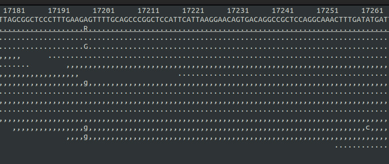

```{r setup, include = FALSE}

library(ggplot2)
library(RColorBrewer)
library(knitr)
library(ape)

knitr::opts_chunk$set(echo = FALSE,fig.align='center')

#<div style="text-align: right;">📝</div>

```

## 


```{r, out.width = "85%"}
include_graphics("./assets/img/ChatGPT Image Nov 2, 2025, 09_29_51 PM.png")
```


## Schedule


| Date | Time | Activity |
|------|------|----------|
| Mon 03/11/2024 | 10:00 to 16:00 | Unix-like systems, bash, connecting to SCWales |
| Tue 04/11/2024 | 10:00 to 16:00 | More bash, SCWales, using SCWales and slurm |
| Wed 05/11/2024 | 10:00 to 16:00 | Illumina data, BEARCAVE, data processing |
| Thu 06/11/2024 | 10:00 to 16:00 | ANGSD, covariance and distance matrices, heterozygosity, intro to R |
| Fri 07/11/2024 | 10:00 to 16:00 | Maps, PCA's, NJ trees, Manhattan plots and Rmarkdown |

## Prequisites

- a computer with internet connection
- an account on super-computing Wales
- basic knowledge of DNA and genome structure

## Resources

### Lecture slides

<https://drabarlow.github.io/bioinformatics_bootcamp/>

### Bootcamp worksheet

<https://drabarlow.github.io/bioinformatics_bootcamp/bootcamp_worksheet_2025.html>

### Github repo

<https://github.com/drabarlow/bioinformatics_bootcamp>

### Supercomputing Wales shared project

- please request access to: **scw2141 Bioinformatics training**


## Introductions

### Axel Barlow, Lecturer in Zoology at Bangor University

- Self taught post-PhD
- No proper bioinformatics/computer science background
- Knowledge of `bash` and `R`.

### Johanna Paijmans, Lecturer in Zoology at Bangor University

- Self taught (rebelling against a Linux-expert dad)
- No proper bioinformatics/computer science background
- Knowledge of `bash` and `R`.


## Introductions


```{r, out.width = "70%"}

```


# Unix-like systems and bash


## Unix {.flex-cols .white-slide}


- Operating system developed in 1969 by Bell Labs
- Unix philosophy: *operating system should provide a set of simple tools, each of which performs a limited, well-defined function.*
- Modular (small programs strung together)
- Inter-process communication: "pipes"
- Separate normal and "super" users (`sudo`)
- Hierarchical filesystem
- A shell for executing and combining tools
- The basis of many subsequent OS


```{r, out.width = 200}
include_graphics("./assets/img/unix-an-open-group-standard.png")

```


## Unix

<iframe src = 'https://en.wikipedia.org/wiki/Unix' height='600px'></iframe>


## Unix-like systems {.columns-2}


**Mac OS**

- Released 1984
- Developed from NeXTSTEP, which is developed from Unix
- Proprietary, Apple hardware only

**Linux**

- 21 year old Linus Torvalds coded a Unix inspired OS in 1991
- Free and open source
- The core linux kernel available under many distributions: Ubuntu, Mint, Arch, Android, Tesla, etc.
<br> 

```{r, out.width = 450}
include_graphics("./assets/img/main-qimg-592cd3e8f514ec3fd00dd6490d889926-lq.jpeg")
```


## MS-DOS (Windows) {.flex-cols}

- Developed by Microsoft, released 1981
- Main OS for IBM PCs in 1980s
- GUI introduced with Windows, released 1985
- Largest market share (70% of PCs)
- Some bioinformatics possible (e.g. `R` typically via `Rstudio`)
- No `bash`
- Encoding of text files is different
- Majority of bioinfomatics software unsupported
- Windows subsystem for linux <https://learn.microsoft.com/en-us/windows/wsl/install>
- Seamless transfer between `DOS` and `Unix` not yet possible


```{r, out.width = 200}
include_graphics("./assets/img/Msdos-icon.svg.png")
include_graphics("./assets/img/StartingMsdos.png")
```


## Windows Subsystem for Linux

- Released in 2016
- Allows installation of Linux distributions (e.g. Ubuntu) within Windows 10/11
- Provides a bash terminal and Linux environment
- Transfer between Windows and Linux filesystems possible
- Essentially WSL is Microsoft's admittance to Linux superiority


```{r, out.width = 200, fig.align='right'}
include_graphics("./assets/img/WSL.png")
```


## OS comparison

| |Windows|Mac|Linux|
|---|-------|---|-----|
|standard PC functions|yes|yes|yes|
|cost|yes|yes|free|
|hardware choice|yes|no|yes|
|bioinformatics|no|yes|yes|
|HPC|no|no|yes|
|open source|no|no|yes|
|active community|no|no|yes|
|games|yes|no|no|


## Terminal emulators and Bash

<div style="display: flex; align-items: flex-start;">
<div style="flex: 0 0 80%;">
- A shell allows users to execute OS tools
- Accessed using a terminal
- Unix terminal came with the Bourne shell (`sh`), developed by Steven Bourne in 1979
- In 1979 Brian Fox in improved version: the Bourne again shell (`bash`)
</div>
<div style="flex: 1; margin-left: 15px;">

</div>
</div>

- Most Unix-like OS (incl Mac) use `bash` or something like it
  - execute standard OS functions and installed programs
  - access filesystem
  - supports bash scripts
  - pipes, auto-completion, loops, wildcards, etc.


# Supercomputing Wales

<!--
## Supercomputing Wales (SCW) {.white-slide}

- £16m investment, part-funded by the European Regional Development Fund (ERDF) through Welsh Government
- Provide university research teams access to HPC (High Performance Computing)
- Consortium of Cardiff, Swansea, Bangor and Aberystwyth
- 2 Supercomputers:
  - Cardiff HPC System - Hawk
  - Swansea HPC System - Sunbird
- Hawk: >300 nodes, >20,000 cores, >100 TB memory

<div style="display: flex; align-items: flex-start;">
<div style="flex: 0 0 60%;">
- (yours: 1 node, 4-16 cores, 8-32 Gb memory)
</div>

<div style="flex: 1; margin-left: 15px;">

</div>
</div>
--> 

## Hawk

```{r, out.height = 500, out.width = "auto", fig.align='center'}

```


## Hawk

- **Computational nodes**
  - \>134x Intel nodes with 40 cpus + 192 Gb RAM each
  - \>64x AMD nodes with 64 cpus + 256 Gb RAM each
  - \>26x Highmem nodes with 384 Gb RAM each
  - \>28x Nvidia GPU nodes
- **Storage space**
  - 1192TB (usable) scratch space
  - 420TB of home directory space

<div style="display: flex; align-items: flex-start;">

<div style="flex: 0 0 80%;">
- **Support**
  - Online documentation <https://www.supercomputing.wales/>
  - eResearch manager Ade Fewings (a.fewings@bangor.ac.uk)
</div>

<div style="flex: 1; margin-left: 15px;">

</div>

</div>

<!--
## Hawk

- **Scientific Linux OS**
  - Command-line only (`ssh`)
  - File transfer using `scp`
- **Space & quota**
  - Home directory (small, persistent): 100Gb
  - Scratch space (bigger, temporary): SCW projects, few Tb
  - Max 10 active jobs, max 30 in the queue
  - Max 3 day runtime

<div style="display: flex; align-items: flex-start;">

<div style="flex: 0 0 80%;">
- **Support**
  - Online documentation <https://www.supercomputing.wales/>
  - eResearch manager Ade Fewings (a.fewings@bangor.ac.uk)
</div>

<div style="flex: 1; margin-left: 15px;">

</div>

</div>
-->

## Hawk usage

- Command-line only (via `ssh`)
- Access through SSH jump host
- File transfer using `scp` or `sftp`
- Job submission using `slurm` job scheduler
- Software installed as `modules`
- No super user access
- **Space & quota**
  - Home directory (small, persistent): 50Gb
  - Scratch space (bigger, temporary): SCW projects, few Tb
  - Max 10 active jobs, max 30 in the queue
  - Max 3 day runtime

## Secure shell (SSH)

```{r, out.width = "100%"}

```

## SSH via jump host

```{r, out.width = "100%"}

```

## SSH via jump host

```{r, out.width = "100%"}

```

## Getting logged on...

**Connecting to the jump host (with MFA)**
```sh
ssh you25usr@ssh.bangor.ac.uk
```
*Note: most UNIX systems do not show anything when you're typing your password!*

<div style="height:30px;"></div>

**If successful, connecting to Hawk**
```shell
ssh b.you25usr@hawklogin.cf.ac.uk
```
<div style="height:30px;"></div>

<span style="font-size: 150%;"> ***Raise your hand if you are having issues*** 🙌</span> 


# AI

## A brief note on AI in Bioinformatics

- AI tools are becoming increasingly common in bioinformatics (and everywhere else)
- Different models are better or worse for different tasks (e.g. I find ChatGPT 4 is not great at programming)
- But it doesn't know everything, and it can't do everything
- You need knowledge of coding, assessing output, error messages, structure, logic, etc
- Also the standard AI considerations: ethics, reproducibility, accuracy, privacy...


## A brief note on AI in Bioinformatics

<video width="100%" controls style="display:block; margin:auto; border-radius:12px;">
  <source src="assets/img/simplescreenrecorder-2025-10-29_11.10.09.mp4" type="video/mp4">
</video>


## Filesystem

- `/` [root] is uppermost level of filesystem
- Everything is contained in `/`
- Directories exist within the filesystem, they can contain files and other directories
- We specify a path through this hierarchy using forward-slashes
- Our current directory is called the `working directory`

```sh
/home/b.xlb21brx/
/scratch/b.xlb21brx/
```
- We can navigate through the filesystem (change working directory)
- Or we can specify the patch to directories or files remotely

## Copying files via SCP {.white-slide}

```{r, out.width = "100%"}

```

## Slurm 

- Simple Linux Utility for Resource Management: `slurm`
- Free open source job scheduler for linux systems
- Used on 60% of World's top 500 computers
- Assigns user jobs to computer resources 
- Submit to queue
- Short, low-resource jobs move faster through the queue
- Useful tools for scheduling, reporting, etc


```{r, out.width = 200, fig.align='right'}
include_graphics("./assets/img/1024px-Slurm_logo.svg.png")
```


# Illumina data

## Illumina sequencing platforms

```{r, out.width = "100%"}
  include_graphics("./assets/img/illumina.svg")
```


## Illumina summary

- The current market leader
- Massive output
- Many applications (genome resequencing, RADseq, transcriptomes, metabarcoding)
- Cheap (£10 per Gb)
- Major limitation is the read length


## Data output

|Platform | Million reads | Read length | Gb data | Genome coverage|
|---|---|---|---|---|
|iSeq|4|2 x 150 bp|1.2|0.4x|
|MiniSeq|25|2 x 150 bp|7.5|2.5x|
|MiSeq|100|2 x 500 bp|30|10x|
|Nextseq 550|400|2 x 150 bp|120|40x|
|NextSeq 1000/2000|1800|2 x 300 bp|540|180x|
|NovaSeq 6000|20000|2 x 250 bp|3000|1000x|
|NovaSeq X|52000|2 x 150 bp|8000|2667x|


## Sequencing by synthesis {.flex-cols}

1. Sample preparation
2. Bind DNA to flowcell
3. Generate clusters
4. Sequencing by synthesis
5. Image analysis 

<div style="width:60%; margin:auto; margin-top:-15px;">
<iframe width="600" height="350" src="https://www.youtube.com/embed/fCd6B5HRaZ8" frameborder="0" allow="accelerometer; autoplay; clipboard-write; encrypted-media; gyroscope; picture-in-picture; web-share" allowfullscreen></iframe>
</div>


## Sample preparation

```{r, out.width = "100%"}
  include_graphics("./assets/img/library_molecule.svg")
```

*Indexes allow multiple samples to be sequenced at the same time


## Flow cell {.white-slide}

```{r, out.width = "80%"}
  include_graphics("./assets/img/flowcell.svg")
```


## Cluster generation {.white-slide}

```{r, out.width = 900}
  
```


## Sequencing by synthesis {.white-slide}

```{r, out.width = "100%"}
  include_graphics("./assets/img/sbs.svg")
```


## Data analysis (in the machine) {.white-slide}

```{r, out.width = "85%"}
  include_graphics("./assets/img/dataanalysis.svg")
```


## What do we sequence?

[Not an exhaustive list]

- **Whole genome sequencing (pure DNA sample from a single individual)**
- Reduced representation genome data (RADseq, targeted SNPs, single individual)
- Poolseq (multiple individuals)
- Transcriptome (RNA sample from single tissue/individual)
- Metabarcoding (PCR amplicon, multiple individuals/species)
- Metagenomics (whole genomes, multiple individuals/species)


## Whole genome sequencing

Short reads from a single individual can be mapped to a reference genome assembly

```{r, out.width = "95%"}
  include_graphics("./assets/img/pseudohap.svg")
```


## Whole genome sequencing

```{r, out.width = "100%", .fig.align = "left", fig.cap=""}
  
```


## Our project: adder population genomics {.flex-cols}


- Adders (*Vipera berus berus*) widespread across northern Eurasia
- Threatened or near-threatened in UK
- Illumina PE data from 47 individuals
- Plus one outgroup (*Vipera berus bosniensis*)
- 12 locations
- **Our tasks**
  - Data format
  - Adapter trimming and read merging
  - Map to reference genome: chr7


```{r, out.width = 300, results='asis'}
include_graphics("./assets/img/male.jpg")
cat("<span style='display:inline-block; width: 30px;'></span>")
include_graphics("./assets/img/female.jpg")
```


## Adder locations

```
      +-------------+---------------+
      |   Sample    |   Locality    |
      +-------------+---------------+
      | adder01-04  | Leeds         |
      | adder05-08  | Wensleydale   |
      | adder09-12  | Manchester    |
      | adder13-16  | Caerphilly    |
      | adder17-20  | Gouda         |
      | adder21-24  | Stockholm     |
      | adder25-27  | Cheddar       |
      | adder28-31  | Huddersfield  |
      | adder32-35  | Sheffield     |
      | adder36-39  | Leicester     |
      | adder40-43  | Nottingham    |
      | adder44-47  | Stilton       |
      | adderout    | outgroup      |
      +-------------+---------------+
```


# Illumina data processing

## .fastq file format

- fastq is the standard output format for data from Illumina (and other) platforms

```bash
@A00551:758:HKTVJDSX7:4:1101:3595:6872 1:N:0:CCTGAGATGT+GGTCTAGTTG
CTGAATATGGATTTTAATTGAATCCTAAGATATTATAGCATCTTTCACTCCCTGTCCTGTGCATGTCAGA
+
FFFFFFFFFFFFFFFFFFFFFFFFFFFFFFFFFFFFFFFFFFFFFFFFFFFFFFFFFFFFFFFFFFFFFF
```

- **Line 1**: info on sequencer, flowcell, cluster position, indexes (sometimes)
- **Line 2**: called bases
- **Line 3**: a +
- **Line 4**: quality scores on Phred scale
- 10 = 90% accuracy; 20 = 99% accuracy; 30 = 99.9% accuracy
- Recoded as single character: F = 37; ? = 30; 5 = 20; + = 10


# BEARCAVE


## BEARCAVE

- Nikolas Basler, Achim Klittich, Axel Barlow
- An environment for organising, processing, and archiving Illumina data
- BEARCAVE philosophy
  - All users can access all data
  - Avoid data redundancy
  - All samples processed using identical software programs and parameters
  - Incorporates sample metadata
  - Documents results of data processing
  - Easy to use wrapper scripts for programs
  - Publicly available
  - Safeguards in place to ensure consistency
- Consequently BEARCAVE is not for everyone, and has idiosyncrasies in use


# Adapter trimming and read merging

## DNA fragment length distribution {.columns-2 .white-slide}

- DNA can be fragmented
- The fragment lengths have a **distribution**

<div style="height:50px;"></div>

```{r, out.width = "80%"}
include_graphics("./assets/img/kudarensis.png")
```

45 ka cave bear (*Ursus kudarensis*)


```{r, out.width = "100%", out.height = "100%", fig.width = 8, fig.height = 9, dpi = 600}
# function for calculating mode
getmode <- function(v) {
   uniqv <- unique(v)
   uniqv[which.max(tabulate(match(v, uniqv)))]
}

adna <- read.table("./assets/data/HV74-Dab-SS_S12_dataset1_rld.txt", header=TRUE)

plot <- ggplot(adna) +
  geom_histogram(aes(x=bp), fill="lightgrey", colour="black", show.legend=TRUE, bins = 30) +
  theme_bw(base_size = 25)+
  labs(x="DNA fragment length (bp)", y="count")

plot
```

 

## Effect of insert size

```{r, out.width = "100%"}
include_graphics("./assets/img/trim1.svg")
```

 

## Effect of insert size

```{r, out.width = "100%"}

```

 

## Effect of insert size

```{r, out.width = "100%"}
include_graphics("./assets/img/trim3.svg")
```

 

## Effect of insert size

```{r, out.width = "100%"}
include_graphics("./assets/img/trim4.svg")
```

 

## Effect of insert size

```{r, out.width = "100%"}
include_graphics("./assets/img/trim5.svg")
```

 

## Effect of insert size

```{r, out.width = "100%"}
include_graphics("./assets/img/trim6.svg")
```

 

## Adapter trimming

```{r, out.width = "100%"}
include_graphics("./assets/img/trim9.svg")
```

 

## Overlapping reads are merged

```{r, out.width = "100%"}
include_graphics("./assets/img/trim10.svg")
```


## BEARCAVE script {.white-slide}

- decompress fastqs
- trim adapter seqs using `Cutadapt`
  - 30 bp min length
  - min overlap 1 bp
- merge overlapping read pair using `FLASH`
- recompress files and clean up 
- save appropriate log files

**Expected output in** `/BEARCAVE2/trimdata/*processing/`

- merged reads `*_mappable.fastq.gz` [big file]
- unmerged R1 `*_mappable_R1.fastq.gz` [big file]
- unmerged R2 `*_mappable_R2.fastq.gz` [big file]
- trim report `*_trim_report.log` and merge report `*_merge_report.log`


## Cutadapt

```{r, out.width = "100%", out.height=500, .fig.cap=""}
include_graphics("./assets/img/2011-Cutadapt_removes_adapter_sequences_from_high-throughput_sequencing_reads.pdf")
```

 

## FLASH

```{r, out.width = "100%", out.height=500, .fig.cap=""}
include_graphics("./assets/img/2011-FLASH_fast_length_adjustment_of_short_reads_to_improve_genome_assemblies..pdf")
```


# Mapping


## BEARCAVE mapping script

- decompress fastqs
- merged (SE) and PE data processed separately
  - mapping using `bwa` mem algorithm
  - PCR duplicates identified and removed using `samtools`
  - Reads with poor mapping quality (Q30) removed using `samtools`
- SE and PE data merged
- mapping log file generated
- file cleanup and renaming

**Expected output in** `/BEARCAVE2/mapped*/*processing/`

- mapped filtered data `*.bam` [big file]
- bam index `*.bam.bai`
- mapping log `*_mapping.log`


## bwa

```{r, out.width="100%", out.height=500}
include_graphics("./assets/img/2009-Fast_and_accurate_short_read_alignment_with_Burrows-Wheeler_transform..pdf")
```

 

## samtools (48,024 citations)

```{r, out.width="100%", out.height=500}
include_graphics("./assets/img/2009-The_Sequence_AlignmentMap_format_and_SAMtools.pdf")
```


# Population genomics using ANGSD


## angsd

- Widely used program
- MANY population genetics analyses possible
- Tends to work directly from bam files (unlike `plink`, `admixtools`, etc)
- MANY filters available
- Genotype likelihood approach is a particular speciality

Allele1|Allele2|prob11|prob12|prob22
||||
A|T|0.05|0.9|0.05

- Several spin off programs that use GLs
  - `NGSadmix`
  - `PCangsd`
  - `NGSrelate`
  - `realSFS`


## angsd website

<iframe src = 'https://www.popgen.dk/angsd/index.php/ANGSD' height='600px'></iframe>


## angsd paper

```{r, out.width = "100%", out.height=500, .fig.cap=""}
include_graphics("./assets/img/2014-Open_Access_ANGSD__Analysis_of_Next_Generation_Sequencing_Data.pdf")
```


## Analyses

**Covariance matrix**

- All indviduals
- Allele frequency covariance matrix
- Used for PCA

**Distance matrix**

- All individuals
- absolute genetic distance between populations
- used as input for NJ algorithm

**Heterozygosity**

- Your single adder
- Calculate GLs, ML estimation of SFS along a sliding window using `realSFS`

# Intro to R

## What is `R` {.flex-cols}

- `R` was born from `S` in the Bell labs in 1992
- Statistical analysis 
- Data visualisation
- Free and open source
- Linux, Mac, Windows
- Many additional packages
- Several GUIs e.g. `Rstudio`
- Graphics (even interactive), text documents, websites
- This presentation!


```{r, out.width = 300}
include_graphics("./assets/img/R_logo.svg.png")
```


## `R` from a heretic and a pragmatist 

*(guess who is who)*

**Most people disagree (in some cases strongly)**

- Base `R` is really good!
- `R` ≠ `Rstudio`
- `tidyverse` is not the way to teach `R` to beginners
- Data doesn't have to be `tidy`
- `ggplot2` code is restrictive
- It's boring if everyone's graphs look the same
- It's OK to type commands directly into the terminal
- It's OK to modify a raw data file
- It's OK to combine other tools and languages


## How `R` works

***"Everything is an object; everything that happens is a function"***

## How `R` works {.white-slide}

```{r, out.width = "100%"}

```


## Objects and functions

**Objects**

- Contain data and results
- Created with `<-`
- Stored in active memory
- Names include letters numbers _ .
- Names must begin with a letter

**Functions**

- Carry out operations on objects
- Often generates new objects
- `function()`
- `?function`

## Data structures: vector and matrix

**Vector**

- List of values of the same type
- Numbers, strings, or logical values
- Can be generated using `c()`
- Indexing vector objects `my_vector[]`

**Matrix**

- 2D data of same type in rows and columns
- Indexing matrix objects `my_matrix[row, column]`

## Data structures: dataframe and list

**Dataframe**

- Rectangular "table"
- Mixture of data types
- Set of vectors of equal length
- Extract columns with `$`, which can then be indexed like vectors

**List**

- Set of components with different structures
- Extract named components with `$`


## Data structures: as shapes {.white-slide}

```{r, out.width = "90%"}
include_graphics("./assets/img/dataStructures.png")
```


## `Rstudio`

- GUI for `R`
- Preferred by many
- Linked to `tidyverse`
- Linked to `R markdown`
- Version control (`git`) and other development tools

## `Rstudio`

```{r, out.width = "90%"}
include_graphics("./assets/img/Screenshot from 2024-11-06 20-20-24.png")
```

<!--
## `Tidyverse` {.columns-2}

- `ggplot2`
- `tibble`
- `tidyr`
- `readr`
- `dplyr`
- `stringr`
- `purr`
- `forcats`
- "Tidy data"
- "Grammar of graphics"

```{r, out.width = "80%"}
include_graphics("./assets/img/Tidyverse_hex_logo.png")
```
-->
<!--
## Maps {.flex-cols}

- Plot samples on a map (lat/lon coordinates)
- Add a distribution to it
- Many different ways
- Here we are using `rworldmap` and `sf`

```{r, out.width = 600,fig.align='right'}

```
-->

## Population genetics: PCA {.columns-2}


- Input is allele covariance matrix
- eigen decomposition `eigen()`
- Actually a recent method
- No knowledge of PC loadings in terms of SNPs/sites
- PC scatterplot
- PC variance explained


```{r, out.width = "80%", fig.width = 4.5, fig.height = 5}
my_info <- read.table("./assets/data/bam_info", header=TRUE)

# read in covariance matrix
my_cov <- read.table("./assets/data/bamlist_old.covMat")

# do PCA
my_pca <- eigen(my_cov)

# plot
plot(my_pca$vectors[,1], my_pca$vectors[,2], pch=21, bg=my_info$colour, xlab="PC1, 20% variance", ylab="PC2, 10% variance")
```

#  Population genetics

## Population genetics: Neighbour-joining clustering {.columns-2}


- Input is distance matrix
- Neighbour joining algorithm
- Clusters based on genetic similarity
- Rooted using outgroup
- Requires `ape` library
- Basic estimate of phylogeny


```{r, out.width = "80%", fig.width = 4.5, fig.height = 4}
# read in matrix
my_mat <- as.dist(read.table("./assets/data/bamlist_old.ibsMat"))

# compute tree
my_tree <- nj(my_mat)

# sort out plot margins
par(mar=c(1,1,1,5), xpd=TRUE)

# plot
my_root <- root(my_tree, node=34)
plot(my_root)
```


## Heterozygosity {.white-slide}

- Input is sliding window estimates of heterozygous sites


<div style="display: flex; align-items: flex-start;">

<div style="flex: 0 0 50%;">

```{r, out.width = "96%", fig.width = 4.5, fig.height = 4}
my_sfs <- read.table("./assets/data/adder01_het_old.window.sfs")
hist((my_sfs$V2/1000), breaks=40, xlab="het sites per kb", main="", col="blue")
```
</div>
<div style="flex: 1; margin-left: 15px;">

```{r, out.width = "100%", fig.width = 4.5, fig.height = 4}
my_sfs <- read.table("./assets/data/adder01_het_old.window.sfs")
plot(1:length(my_sfs$V2), my_sfs$V2/1000, pch=20, col="blue", axes=FALSE, xlab="chromosome 7", ylab="het sites per kb")
axis(1, labels=FALSE)
axis(2)
```
</div>

</div>

# Rmarkdown

## Rmarkdown

- Dynamic documents in Rstudio
- Combine text, code, and results
- Publishers are increasingly asking for reproducible code capsules

## Reproducability

<iframe src = 'https://www.springernature.com/gp/open-science/code-policy' height='600px'></iframe>

## Rmarkdown example

<iframe src = 'https://drabarlow.github.io/bioinformatics_bootcamp/bootcamp_worksheet_2025.html' height='600px'></iframe>

# That's all folks!

**See you next year :)**
