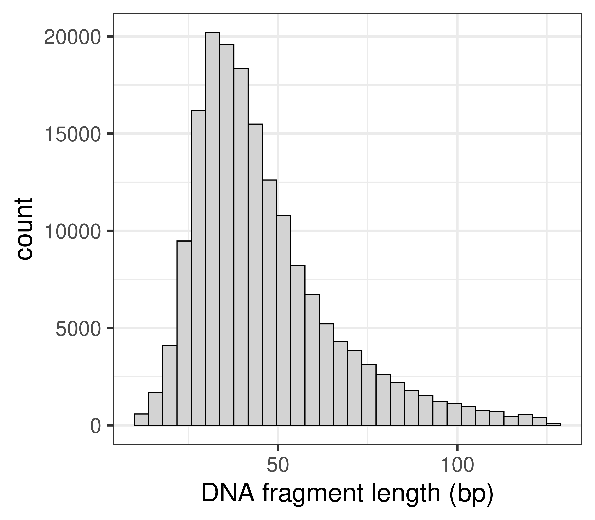

<!-- adding bold and italic options -->
<style>
em {
  font-style: italic
}
strong {
  font-weight: bold;
}
</style>

## Schedule

Date|Time|Activity
---|---|---
Tue 03/10/2023 | 09:30 to 13:00 | Unix-like systems and bash
Wed 04/10/2023 | 12:00 to 14:00 | Super-computing Wales and slurm
Mon 9/10/2023 | 14:00 to 17:00 | Illumina data and BEARCAVE
Tue 10/10/2023 | 09:30 to 17:00 | Illumina data processing
Wed 11/10/2023 | 09:30 to 15:30 | ANGSD, covariance and distance matrices
Fri 13/10/2023 | 14:00 to 17:00 | Intro to R, PCA and plotting, NJ trees and plotting

---

## Prequisites

- a laptop that can connect to university wifi/eduroam
- an account on super-computing Wales
- For windows users, installation of the ssh client PuTTY
- Basic knowledge of DNA and genome structure

---

## Resources

### Lecture slides

<https://drabarlow.github.io/bioinformatics_bootcamp/>

### Bootcamp worksheet

<https://drabarlow.github.io/bioinformatics_bootcamp/bootcamp_worksheet.html>

### Github repo

<https://github.com/drabarlow/bioinformatics_bootcamp>

### Supercomputing Wales shared project

- please request access to: **scw2141 Bioinformatics training**

---

## Introductions

### Axel Barlow, Lecturer in Zoology at Bangor University

**Interests**
- Population and evolutionary genomics of animals. Palaeogenomics of extinct animals. Conservation genomics of native species

**Bioinformatics experience**
- Working in the field for ten years
- Entirely self taught post-PhD
- No proper bioinformatics/computer science background
- Knowledge of bash and R.

--- .segue .dark 

## Unix-like systems and bash

--- &twocol

## Unix

*** =left

- Operating system developed in 1969 by Bell Labs
- Unix philosophy: *operating system should provide a set of simple tools, each of which performs a limited, well-defined function.*
- Modular (small programs strung together)
- Inter-process communication: "pipes"
- Separate normal and "super" users (`sudo`)
- Hierarchical filesystem
- A shell for executing and combining tools
- The basis of many subsequent OS

*** =right


---

## Unix

<iframe src = 'https://en.wikipedia.org/wiki/Unix' height='600px'></iframe>

--- &twocol

## Unix-like systems

*** =left

**Mac OS**

- Released 1984
- Developed from NeXTSTEP, which is developed from Unix
- Proprietary, only available with Apple hardware

**Linux**

- 21 year old Linus Torvalds coded a Unix inspired OS in 1991
- Free and open source
- The core linux kernal available under many distributions: Ubuntu, Mint, Arch, RedHat, Android, etc.

*** =right


--- &thirds_alt

## MS-DOS (Windows)

*** =left

- Developed by Microsoft, released 1981
- Main OS fro IMB PCs in 1980s
- GUI introduced with Windows, released 1985
- Largest market share (70% of PCs)
- Some bioinformatics possible (e.g. `R` typically via `Rstudio`)
- No `bash`
- Encoding of text files is different
- Majority of bioinfomatics software unsupported
- Windows subsystem for linux <https://learn.microsoft.com/en-us/windows/wsl/install>
- Seamless transfer between `DOS` and `Unix` not yet possible

*** =right


---

## OS comparison

 |Windows|Mac|Linux
---|---|---|---
standard PC functions|yes|yes|yes
cost|yes|yes|free
hardware choice|yes|no|yes
bioinformatics|no|yes|yes
HPC|no|no|yes
open source|no|no|yes
active community|no|no|yes
games|yes|no|no

--- &twocol

## Bash

*** =left

- a shell allows users to access OS tools
- Unix came with the Bourne shell (`sh`), developed by Steven Bourne in 1979
- In 1979 Brian Fox in improved version: the Bourne again shell (`bash`)
- Most Unix-like OS use `bash` or something like it
  - execute standard OS functions
  - access filesystem
  - execute installed programs
  - supports bash scripts
  - pipes, auto-completion, loops, wildcards, etc.
  

*** =right


--- .segue .dark 

## Supercomputing Wales and slurm

--- bg:white

## Supercomputing Wales

- £16m investment, part-funded by the European Regional Development Fund (ERDF) through Welsh Government
- Provide university research teams access to HPC
- Consortium of Cardiff, Swansea, Bangor and Aberystwyth
- 2 Supercomputers:
  - Cardiff HPC System - Hawk
  - Swansea HPC System - Sunbird
- Hawk: 280 nodes, 12,736 cores, 68.224 TB memory


---

## Hawk

- Scientific linux OS
- **compute nodes**
  - 134x Intel nodes with 20 cpus + 192 Gb RAM each
  - 64x AMD nodes with 32 cpus + 256 Gb RAM each
- **high memory nodes**
  - 26 nodes with 384 Gb RAM each
- **GPU nodes**
  - 26 Nvidia P100 GPUs on 13 nodes
  - 30 Nvidia V100 GPUs on 15 nodes
- **Storage**
  - 1192TB (usable) scratch space
  - 420TB of home directory space

--- &thirds_alt

## Hawk users

*** =left

- Anyone in consortium Universities
- Guests possible, with some restrictions
- Ability to set up shared projects
- Generally max 10 running jobs (ways around it)
- Three day max runtime (ways around it)
- Generally ~50 Gb home dir
- Generally 4 Tb scratch space (currently an issue)
- Uses `Slurm` job scheduler
- Many programs installed as `modules`
- No super user access
- Can seek help from Ade Fewings (a.fewings@bangor.ac.uk)

*** =right


---

## Filesystem

- `/` [root] is uppermost level of filesystem
- Everything is contained in `/`
- Directories exist within the filesystem, they can contain files and other directories
- We specify a path through this hierarchy using forward-slashes (note back-slashes on `DOS`)
- Our current directory is called the `working directory`

```bash
/home/b.xlb21brx/
/scratch/b.xlb21brx/
```
- We can navigate through the filesystem (change working directory)
- Or we can specify the patch to directories or files remotely

--- &twocol

## Slurm

*** =left

- Simple Linux Utility for Resource Management: `Slurm`
- Free open source job scheduler for linux systems
- Used on 60% of World's top 500 computers
- Assigns user jobs to computer resources 
- Submit to queue
- Short, low-resource jobs move faster through the queue
- Other tools for scheduling, reporting, etc

*** =right


--- .segue .dark 

## Illumina data

---

## Illumina sequencing platforms


---

## Data output

Platform | Million reads | Read length | Gb data | Genome coverage
---|---|---|---|---
MiniSeq|25|2 x 150 bp|7.5|2
MiSeq|25|2 x 300 bp|15|4
NextSeq|400|2 x 150 bp|120|33
HiSeq X|6000|2 x 150 bp|1800|500
NovaSeq|20000|2 x 150 bp|6000|1667

---

## Sequencing by synthesis

1. Sample preparation
2. Bind DNA to flowcell, generate clusters
3. Sequencing by synthesis
4. Data analysis (in the machine)

<https://www.youtube.com/watch?v=fCd6B5HRaZ8>

---

## Sample preparation


*Indexes allow multiple samples to be sequenced at the same time

---

## Flow cell


--- bg:white

## Cluster generation


--- bg:white

## Sequencing by synthesis


--- bg:white

## Data analysis (in the machine)


---

## What do we sequence?

[Not an exhaustive list]

- **Whole genome sequencing (pure DNA sample from a single individual)**
- Reduced representation genome data (RADseq, targeted SNPs, single individual)
- Poolseq (multiple individuals)
- Transcriptome (RNA sample from single tissue/individual)
- Metabarcoding (PCR amplicon, multiple individuals/species)
- Metagenomics (whole genomes, multiple individuals/species)

---

## Whole genome sequencing

Short reads from a single individual can be mapped to a reference genome assembly


---

## Whole genome sequencing


---

## Illumina summary

- The current market leader
- Massive output
- Many applications (genome resequencing, RADseq, transcriptomes, metabarcoding)
- Cheap (£10 per Gb)
- Major limitation is the read length

--- .segue .dark 

## BEARCAVE

---

## BEARCAVE

- Nikolas Basler, Achim Klittich, Axel Barlow
- An environment for organising, processing, and archiving Illumina data
- BEARCAVE philosophy
  - All users can access all data
  - Avoid data redundancy
  - All samples processed using identical software programs and parameters
  - Incorporates sample metadata
  - Documents results of data processing
  - Easy to use wrapper scripts for programs
  - Publicly available
  - Safeguards in place to ensure consistency
- Consequently BEARCAVE is not for everyone, and has idiosyncrasies in use

--- &twocol

## Our project: adder population genomics

*** =left

- Adders (*Vipera berus*) widespread across northern Eurasia
- Threatened or near-threatened in UK
- Illumina PE data from 18 individuals
- 5 locations
- Data format
- Adapter trimming and read merging
- Map to reference genome: chr7

*** =right


---

## Adder locations

sample|locality|colour
---|---|---
adder01|Dublin|red
adder02|Dublin|red
adder03|Belfast|green
adder04|Belfast|green
adder05|Dublin|red
adder06|Dublin|red
adder07|Cork|blue
adder08|Cork|blue
adder09|Cork|blue
adder10|Cork|blue
adder11|Limerick|yellow
adder12|Limerick|yellow
adder13|Limerick|yellow
adder14|Limerick|yellow
adder15|Galway|grey
adder16|Galway|grey
adder17|Belfast|green
adder18|Belfast|green


--- .segue .dark 

## Illumina data processing

---

## .fastq file format

- fastq is the standard output format for data from Illumina (and other) platforms

```bash
@A00551:758:HKTVJDSX7:4:1101:3595:6872 1:N:0:CCTGAGATGT+GGTCTAGTTG
CTGAATATGGATTTTAATTGAATCCTAAGATATTATAGCATCTTTCACTCCCTGTCCTGTGCATGTCAGA
+
FFFFFFFFFFFFFFFFFFFFFFFFFFFFFFFFFFFFFFFFFFFFFFFFFFFFFFFFFFFFFFFFFFFFFF
```

- **Line 1**: info on sequencer, flowcell, cluster position, indexes (sometimes)
- **Line 2**: called bases
- **Line 3**: a +
- **Line 4**: quality scores on Phred scale
- 10 = 90% accuracy; 20 = 99% accuracy; 30 = 99.9% accuracy
- Recoded as single character: F = 37; ? = 30; 5 = 20; + = 10

--- .segue .dark 

## Adapter trimming and read merging

--- &twocol bg:white

## DNA fragment length distribution

- DNA can be fragmented
- The fragment lengths have a **distribution**

*** =left


*** =right


45 ka cave bear (*Ursus kudarensis*)

--- 

## Effect of insert size


--- 

## Effect of insert size


--- 

## Effect of insert size


--- 

## Effect of insert size


--- 

## Effect of insert size


--- 

## Effect of insert size


--- 

## Adapter trimming


--- 

## Overlapping reads are merged


---

## BEARCAVE script

- decompress fastqs
- trim adapter seqs using `Cutadapt`
  - 30 bp min length
  - min overlap 1 bp
- merge overlapping read pair using `FLASH`
- recompress files and clean up 
- save appropriate log files

---

## Cutadapt

<embed src="./assets/img/2011-Cutadapt_removes_adapter_sequences_from_high-throughput_sequencing_reads.pdf" width="100%" height="500" type="application/pdf" />

--- 

## FLASH

<embed src="./assets/img/2011-FLASH_fast_length_adjustment_of_short_reads_to_improve_genome_assemblies..pdf" width="100%" height="500" type="application/pdf" />

--- .segue .dark 

## Mapping

---


